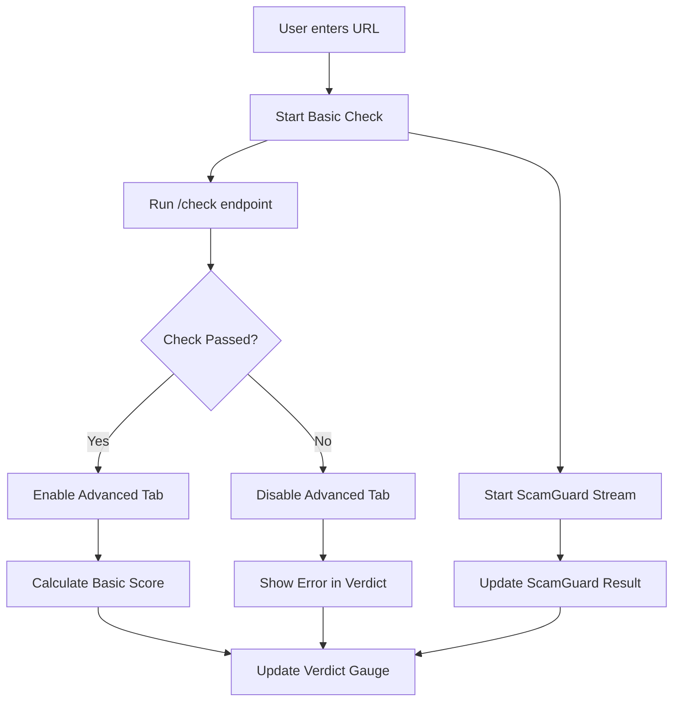
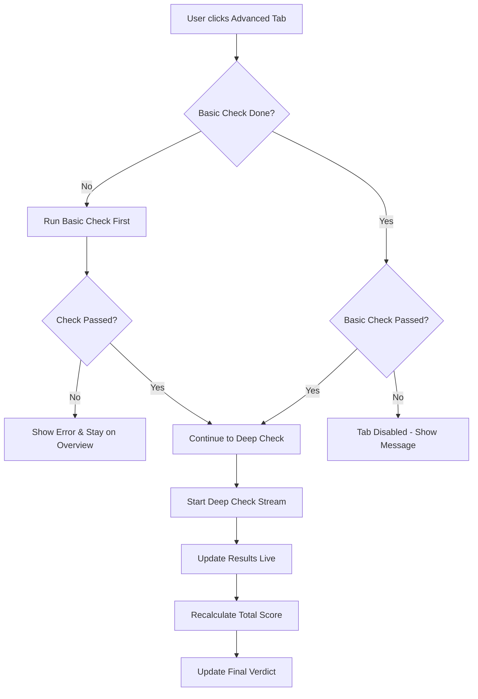

# Blink UI Production-Ready Implementation Plan

## Overview
This document outlines the comprehensive refactoring plan to unify the Overview and Advanced tabs into a cohesive, production-ready UI with integrated scoring and verdict systems.

## Current State Analysis

### Problems with Current Implementation
1. **Disconnected Tabs**: Overview and Advanced tabs operate independently
2. **No Unified Scoring**: Separate verdict calculations without integration
3. **Poor Error Flow**: No tab disabling on errors
4. **Redundant Checks**: If user goes to Advanced directly, basic checks aren't performed
5. **Inconsistent Verdict**: Different verdict sources not properly prioritized

### Existing Assets to Leverage
- Robust scoring system in `security_scoring.go`
- ScamGuard API integration with streaming
- Good state management foundation
- Comprehensive deep-check capabilities

## Architecture Design

### 1. Unified Scoring System

#### Score Components
```
Base Score: 100 points
├── Overview Tab Checks (50 points max)
│   ├── DNS Resolution: 10 points
│   ├── TLS Certificate: 15 points
│   ├── Response Time: 10 points
│   ├── HTTP Status: 10 points
│   └── Redirect Chain: 5 points
│
├── ScamGuard AI Check (30 points max)
│   ├── Safe verdict: 30 points
│   ├── Unknown: 15 points
│   └── Suspicious/Malicious: 0 points
│
└── Deep Check (20 points max) - Only if enabled
    ├── Security Headers: 5 points
    ├── No Trackers: 5 points
    ├── HTTPS Resources: 5 points
    └── No Security Issues: 5 points
```

#### Severity Deductions
- **Critical Issues** (-50 to -100 points):
  - Malicious verdict from ScamGuard
  - Invalid/expired TLS certificate
  - DNS resolution failure

- **Major Issues** (-20 to -40 points):
  - Multiple security issues
  - Mixed content (HTTP resources on HTTPS)
  - Suspicious verdict from ScamGuard

- **Minor Issues** (-5 to -15 points):
  - Missing security headers
  - Presence of trackers
  - Slow response times

#### Final Verdict Calculation
```
Score Range → Verdict
90-100: Safe (green)
70-89: Mostly Safe (light green)
50-69: Caution (yellow)
30-49: Suspicious (orange)
0-29: Dangerous (red)
```

### 2. State Management Architecture

#### Global State Object
```javascript
const AppState = {
  currentUrl: '',
  basicCheckResult: null,
  deepCheckResult: null,
  scamGuardResult: null,

  scores: {
    basic: 0,
    scamGuard: 0,
    deep: 0,
    total: 0,
    verdict: 'unknown'
  },

  flags: {
    basicCheckComplete: false,
    basicCheckPassed: false,
    deepCheckEnabled: false,
    deepCheckRunning: false,
    isProcessing: false
  },

  errors: {
    basic: null,
    scamGuard: null,
    deep: null
  }
};
```

### 3. Tab Flow Logic

#### Overview Tab Flow


#### Advanced Tab Flow


## Implementation Steps

### Phase 1: Backend Modifications

#### 1.1 Create Unified Response Structure
```go
// internal/service/unified_result.go
type UnifiedResult struct {
    URL           string         `json:"url"`
    BasicCheck    *CheckResult   `json:"basic_check"`
    ScamGuard     *ScamGuardResult `json:"scam_guard,omitempty"`
    DeepCheck     *DeepCheckResult `json:"deep_check,omitempty"`
    Score         ScoreBreakdown  `json:"score"`
    FinalVerdict  Verdict        `json:"final_verdict"`
    Errors        []ErrorInfo    `json:"errors,omitempty"`
}

type ScoreBreakdown struct {
    Basic     int    `json:"basic"`
    ScamGuard int    `json:"scam_guard"`
    Deep      int    `json:"deep"`
    Total     int    `json:"total"`
    Details   string `json:"details"`
}

type Verdict struct {
    Level       string `json:"level"` // safe, mostly_safe, caution, suspicious, dangerous
    Confidence  float64 `json:"confidence"`
    Reason      string `json:"reason"`
    Priority    string `json:"priority"` // scamguard, security, performance
}
```

#### 1.2 Implement Scoring Service
```go
// internal/service/scoring.go
type ScoringService struct {
    config ScoringConfig
}

func (s *ScoringService) CalculateScore(result *UnifiedResult) ScoreBreakdown {
    // Implement unified scoring logic
}

func (s *ScoringService) DetermineVerdict(score ScoreBreakdown, scamGuard *ScamGuardResult) Verdict {
    // Priority-based verdict determination
}
```

#### 1.3 Modify Endpoints
- `/check` endpoint returns `UnifiedResult` with basic scoring
- `/deep-check` endpoint updates existing `UnifiedResult`
- Add `/check-status/:id` endpoint for state querying

### Phase 2: Frontend State Management

#### 2.1 Create State Manager
```javascript
// static/js/state-manager.js
class StateManager {
    constructor() {
        this.state = { /* initial state */ };
        this.listeners = new Map();
    }

    updateBasicCheck(result) {
        this.state.basicCheckResult = result;
        this.state.scores.basic = result.score.basic;
        this.updateTotalScore();
        this.notify('basicCheckComplete');
    }

    updateScamGuard(verdict, details) {
        this.state.scamGuardResult = { verdict, details };
        this.state.scores.scamGuard = this.calculateScamGuardScore(verdict);
        this.updateTotalScore();
        this.notify('scamGuardUpdate');
    }

    updateDeepCheck(data) {
        this.state.deepCheckResult = data;
        this.state.scores.deep = this.calculateDeepScore(data);
        this.updateTotalScore();
        this.notify('deepCheckUpdate');
    }

    updateTotalScore() {
        const { basic, scamGuard, deep } = this.state.scores;
        this.state.scores.total = basic + scamGuard + deep;
        this.updateVerdict();
    }

    updateVerdict() {
        const score = this.state.scores.total;
        let verdict = 'safe';

        // Priority: ScamGuard verdict overrides if malicious
        if (this.state.scamGuardResult?.verdict === 'malicious') {
            verdict = 'dangerous';
        } else if (score >= 90) {
            verdict = 'safe';
        } else if (score >= 70) {
            verdict = 'mostly_safe';
        } else if (score >= 50) {
            verdict = 'caution';
        } else if (score >= 30) {
            verdict = 'suspicious';
        } else {
            verdict = 'dangerous';
        }

        this.state.scores.verdict = verdict;
        this.notify('verdictUpdate');
    }
}
```

#### 2.2 Tab Controller
```javascript
// static/js/tab-controller.js
class TabController {
    constructor(stateManager) {
        this.state = stateManager;
        this.initEventListeners();
    }

    enableAdvancedTab() {
        const advTab = document.querySelector('[data-tab="advanced"]');
        advTab.classList.remove('disabled');
        advTab.removeAttribute('aria-disabled');
    }

    disableAdvancedTab(reason) {
        const advTab = document.querySelector('[data-tab="advanced"]');
        advTab.classList.add('disabled');
        advTab.setAttribute('aria-disabled', 'true');
        advTab.setAttribute('title', reason);
    }

    switchToTab(tabName) {
        if (tabName === 'advanced') {
            if (!this.state.state.flags.basicCheckComplete) {
                // Run basic check first
                this.runBasicCheckFirst();
                return;
            }

            if (!this.state.state.flags.basicCheckPassed) {
                this.showTabDisabledMessage();
                return;
            }
        }

        // Proceed with tab switch
        this.activateTab(tabName);
    }
}
```

#### 2.3 Unified Check Handler
```javascript
// static/js/check-handler.js
class CheckHandler {
    constructor(stateManager) {
        this.state = stateManager;
    }

    async performFullCheck(url) {
        try {
            // Step 1: Basic Check
            this.state.updateFlags({ isProcessing: true });
            const basicResult = await this.runBasicCheck(url);

            // Step 2: ScamGuard (parallel with basic)
            this.startScamGuardStream(url);

            // Step 3: Determine if Advanced should be enabled
            if (this.isBasicCheckPassed(basicResult)) {
                this.state.updateFlags({
                    basicCheckPassed: true,
                    deepCheckEnabled: true
                });
            } else {
                this.state.updateFlags({
                    basicCheckPassed: false,
                    deepCheckEnabled: false
                });
            }

            // Step 4: If on Advanced tab, run deep check
            if (this.getCurrentTab() === 'advanced' &&
                this.state.state.flags.deepCheckEnabled) {
                await this.runDeepCheck(url);
            }

        } catch (error) {
            this.handleError(error);
        } finally {
            this.state.updateFlags({ isProcessing: false });
        }
    }
}
```

### Phase 3: UI Components Update

#### 3.1 Verdict Gauge Enhancement
```javascript
// Update verdict gauge to show comprehensive score
class VerdictGauge {
    updateScore(scoreData) {
        // Animate to new total score
        this.animateScore(scoreData.total);

        // Update verdict color and label
        this.updateVerdictDisplay(scoreData.verdict);

        // Show score breakdown on hover
        this.setTooltip(this.formatBreakdown(scoreData));
    }

    formatBreakdown(scoreData) {
        return `
            Basic Check: ${scoreData.basic}/50
            AI Analysis: ${scoreData.scamGuard}/30
            Deep Scan: ${scoreData.deep}/20
            Total: ${scoreData.total}/100
        `;
    }
}
```

#### 3.2 Error Display Component
```javascript
class ErrorDisplay {
    showCriticalError(error) {
        // Display in verdict area
        const verdictArea = document.querySelector('.verdict-container');
        verdictArea.innerHTML = this.renderError(error);

        // Disable Advanced tab with reason
        tabController.disableAdvancedTab(error.message);
    }

    renderError(error) {
        const severity = this.getErrorSeverity(error);
        return `
            <div class="error-verdict ${severity}">
                <i class="icon-alert"></i>
                <h3>${error.title}</h3>
                <p>${error.message}</p>
                ${error.details ? `<details>${error.details}</details>` : ''}
            </div>
        `;
    }
}
```

### Phase 4: Edge Cases & Error Handling

#### 4.1 Direct Advanced Tab Access
```javascript
// Handle URL with #advanced hash
if (window.location.hash === '#advanced') {
    // Check if basic check exists for this URL
    const cachedBasic = getCachedBasicCheck(currentUrl);

    if (!cachedBasic) {
        // Run basic check first
        await checkHandler.performFullCheck(currentUrl);
    } else if (!cachedBasic.passed) {
        // Redirect to Overview with error
        window.location.hash = '#overview';
        showError('Cannot access Advanced tab: ' + cachedBasic.error);
    } else {
        // Proceed with deep check
        await checkHandler.runDeepCheck(currentUrl);
    }
}
```

#### 4.2 Network Failure Handling
```javascript
class NetworkErrorHandler {
    handleBasicCheckFailure(error) {
        if (error.type === 'DNS_FAILURE') {
            return {
                severity: 'critical',
                verdict: 'dangerous',
                message: 'Domain does not exist or DNS resolution failed',
                disableAdvanced: true
            };
        }

        if (error.type === 'CONNECTION_TIMEOUT') {
            return {
                severity: 'major',
                verdict: 'suspicious',
                message: 'Site is not responding',
                disableAdvanced: true
            };
        }

        // ... other error types
    }
}
```

#### 4.3 ScamGuard Priority Logic
```javascript
function calculateFinalVerdict(scores, scamGuardResult) {
    // ScamGuard takes priority for malicious verdicts
    if (scamGuardResult?.verdict === 'malicious') {
        return {
            level: 'dangerous',
            reason: 'Identified as malicious by AI analysis',
            priority: 'scamguard'
        };
    }

    // For unknown ScamGuard results, use scoring
    if (scamGuardResult?.verdict === 'unknown') {
        return calculateVerdictFromScore(scores.total);
    }

    // Combine ScamGuard with scoring for nuanced verdict
    return combineVerdicts(scores, scamGuardResult);
}
```

## Testing Strategy

### 1. Unit Tests
- Score calculation logic
- Verdict determination
- State management transitions
- Error classification

### 2. Integration Tests
- Tab flow scenarios
- API endpoint coordination
- Streaming data handling
- Cache behavior

### 3. E2E Test Scenarios
- User enters malicious URL → Advanced tab disabled
- Direct Advanced tab access → Basic check runs first
- Network failure → Appropriate error display
- Full successful flow → All scores calculated

## Migration Plan

### Step 1: Backend Preparation (Day 1-2)
1. Implement unified result structures
2. Create scoring service
3. Update endpoints to return new format
4. Maintain backward compatibility

### Step 2: Frontend Foundation (Day 3-4)
1. Implement state manager
2. Create tab controller
3. Update check handlers
4. Test state transitions

### Step 3: UI Updates (Day 5-6)
1. Update verdict gauge component
2. Implement error displays
3. Add tab disable/enable logic
4. Update progress indicators

### Step 4: Integration & Testing (Day 7-8)
1. Connect all components
2. Run comprehensive tests
3. Fix edge cases
4. Performance optimization

### Step 5: Deployment (Day 9)
1. Deploy to staging
2. User acceptance testing
3. Production deployment
4. Monitor and iterate

## Performance Considerations

### Caching Strategy
```javascript
const CheckCache = {
    basic: new Map(), // URL -> BasicResult
    scamGuard: new Map(), // URL -> ScamGuardResult
    deep: new Map(), // URL -> DeepResult

    getCached(url, type) {
        const cached = this[type].get(url);
        if (cached && Date.now() - cached.timestamp < 300000) { // 5 min
            return cached.data;
        }
        return null;
    }
};
```

### Optimization Points
1. **Debounce URL input** - Prevent excessive API calls
2. **Stream buffering** - Batch UI updates from SSE
3. **Lazy load Advanced tab** - Only load when accessed
4. **Progressive enhancement** - Show results as available

## Security Considerations

1. **Input Validation**: Strict URL validation before any checks
2. **Rate Limiting**: Implement per-IP rate limits
3. **Timeout Protection**: Enforce maximum check duration
4. **XSS Prevention**: Sanitize all displayed content
5. **CORS Policy**: Restrict API access appropriately

## Success Metrics

1. **User Experience**
   - Tab switch time < 100ms
   - Error clarity score > 90%
   - Score calculation accuracy > 95%

2. **Performance**
   - Basic check < 3 seconds
   - Full check < 10 seconds
   - UI responsiveness < 50ms

3. **Reliability**
   - Error handling coverage 100%
   - Graceful degradation for all failures
   - No data loss on tab switches

## Conclusion

This implementation plan provides a comprehensive approach to unifying the Overview and Advanced tabs into a production-ready system. The key improvements include:

1. **Unified Scoring**: Single source of truth for URL safety
2. **Smart Tab Flow**: Logical progression with error handling
3. **Priority System**: ScamGuard results take precedence
4. **Better UX**: Clear feedback and disabled states
5. **Robust Architecture**: Scalable and maintainable code

The phased approach ensures minimal disruption while delivering significant improvements to the user experience.